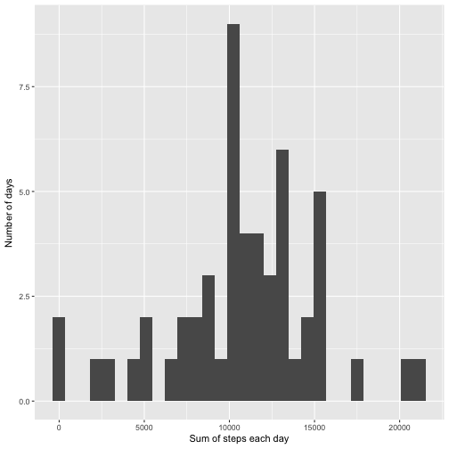
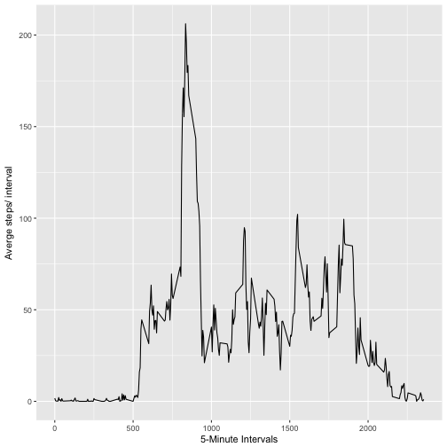
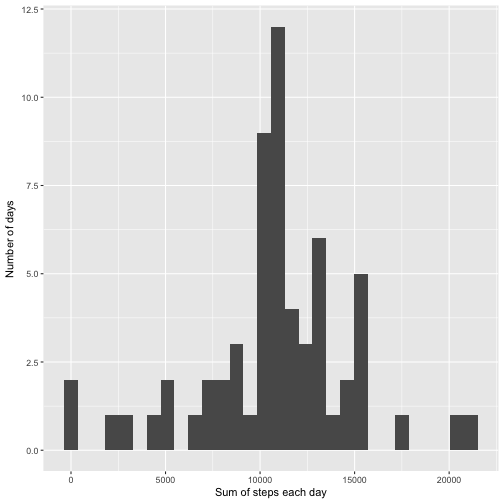
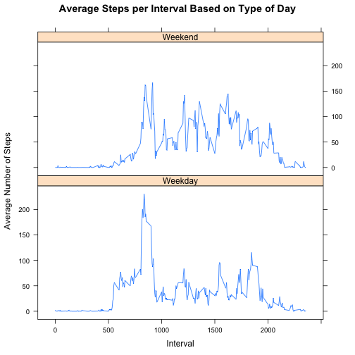

## packages used are loaded 


## Loading and preprocessing Data

1. The first chunk of code is for reading the data from the directory by using "read.csv"
2. the second chunk of code is for processing the dataframe read in part 1. The date column is to be converted from a factor to date object by using "strptime"


```r
direct<- "~/reproproject/activity.csv"
 readcsv <- function(direct){
         read.csv(file= direct, header= TRUE)
         
     
 }
 
 df1<- readcsv(direct)
```

```r
df1$date <- as.Date(df1$date, format="%Y-%m-%d" )
```

## What is mean total number of steps taken per day?

```r
dailysum<- ddply(df1, .(date), summarize, daily_sum= sum(steps))

qplot(daily_sum, data=dailysum)+labs(x= "Sum of steps each day", y= "Number of days")
```

```
## `stat_bin()` using `bins = 30`. Pick better value with `binwidth`.
```

```
## Warning: Removed 8 rows containing non-finite values (stat_bin).
```



```r
mean(dailysum$daily_sum, na.rm= TRUE)
```

```
## [1] 10766.19
```

```r
median(dailysum$daily_sum, na.rm=TRUE)
```

```
## [1] 10765
```


##What is the average daily activity pattern?


```r
intervalmean<- ddply(df1, .(interval), summarize, interval_ave= mean(steps, na.rm = TRUE))

ggplot(intervalmean, aes(interval, interval_ave)) + geom_line()+labs(x= "5-Minute Intervals", y= "Averge steps/ interval", main= "Average Steps per Interval")
```



## Imputing missing values


```r
impute_function<- function(df, values){
        
        for (i in 1:nrow(df)){
                if (is.na(df[i,1])) {
                        df[i,1]<- values[grep(paste("^",df1[i,3],"$", sep= ""), values[,1]),2]
                             
                        }
        }
       return(df)
}
new_df<- impute_function(df1, intervalmean)
```

## Do these values differ from the estimates from the first part of the assignment?

```r
new_dailysum<- ddply(new_df, .(date), summarize, daily_sum= sum(steps))

qplot(daily_sum, data=new_dailysum)+labs(x= "Sum of steps each day", y= "Number of days", main= "histogram of the sum of steps per day")
```

```
## `stat_bin()` using `bins = 30`. Pick better value with `binwidth`.
```



```r
mean(new_dailysum$daily_sum)
```

```
## [1] 10766.19
```

```r
median(new_dailysum$daily_sum)
```

```
## [1] 10766.19
```
Obviously not so much! since the missing values occured only 8 times in the daily sum, the difference is not that drastic.

## Are there differences in activity patterns between weekdays and weekends?


```r
new_df$weekly <- as.factor(ifelse(weekdays( new_df$date) %in% c("Saturday","Sunday"), "Weekend", "Weekday"))
new_intervalmean<- ddply(new_df, .(interval, weekly), summarize, interval_ave= mean(steps))
xyplot(interval_ave~interval|weekly, data=new_intervalmean, type="l",  layout = c(1,2),
       main="Average Steps per Interval Based on Type of Day", 
       ylab="Average Number of Steps", xlab="Interval")
```



The answer is shown in the figure
